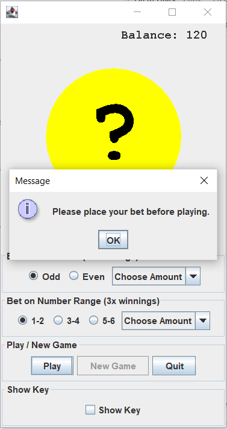

# Dice Roll Game
This is a Dice Roll Game that uses MVC framework.
A random number between 1-6 is generated, and the user can bet on whether the number is odd/even and/or the range the number is in.

# Inital Window
The user first selects "New Game" in the initial window to start the game:

# Game Play
Once the user has started a new game, they can play bets on whether they think the number is odd/even, and/or if the number is in a specific range. 

The user also has the option to show the key, so they can see what the number they are trying to guess is if they would like to.

Once the bets are made, the user presses play, and the number is shown along with their winnings, and the balance at the upper right hand corner is updated accordingly.

If the user does not choose an amount to bet before selecting "Play", a pop up message informs the player to place at least one bet before selecting play.

The player must only choose odd/even or range, they do not have to bet on both.

